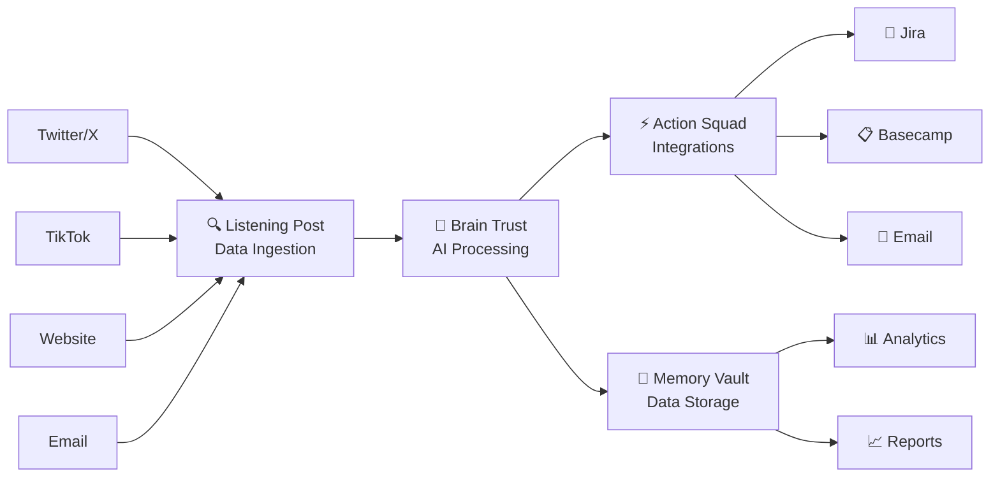

# 🚀 InsightStream AI: Automated Customer Feedback Intelligence

[](https://cloud.google.com/)
[](https://python.org/)
[](https://postgresql.org/)
[](https://cloud.google.com/ai)

> 🎯 **Transform customer feedback into actionable insights with the power of AI**

## 📖 Overview

**InsightStream AI** is a powerful, automated system designed to revolutionize how public-facing companies manage and act upon their customer feedback. Built on Google Cloud Platform, it transforms raw, unstructured feedback from various channels into actionable, categorized insights, driving efficiency and improving customer satisfaction.

---

## 🔍 The Problem

Companies today are overwhelmed by the sheer volume of customer feedback across multiple channels:

- 📱 **Social Media** (Twitter, TikTok, etc.)
- 🌐 **Website Forms**
- 📧 **Email Inboxes**
- 📱 **App Store Reviews**

**The Challenge:** Manually sifting through this data for bug reports, feature requests, sentiment analysis, and competitor mentions is:
- ⏰ Time-consuming
- 🚫 Error-prone
- 📉 Inefficient
- 🐌 Leading to delayed responses and missed opportunities

---

## 💡 Our Solution: InsightStream AI

InsightStream AI provides an intelligent, automated pipeline that addresses these challenges head-on:

### 🔄 Core Components

| Component | Description |
|-----------|-------------|
| 🔍 **Automated Ingestion** | Continuously collects feedback from diverse sources |
| 🧠 **Intelligent AI Processing** | Leverages cutting-edge AI to understand, categorize, and enrich feedback |
| ⚡ **Actionable Integrations** | Automatically routes categorized feedback to the right teams |
| 💾 **Persistent Insights** | Stores all data in structured database for deep analysis |

---

## ✨ Key Features (Current MVP)
### 📥 Multi-Channel Feedback Ingestion

- 🐦 **Twitter (X) Integration**: Automated collection of dummy data
- 🎵 **TikTok**: Ready for expansion
- 🌐 **Website Forms**: Designed for easy integration
- 📧 **Email Inboxes**: Streamlined processing
- 📱 **App Store Reviews**: Comprehensive coverage

### 🤖 Advanced AI Processing

| Feature | Technology | Description |
|---------|------------|-------------|
| 😊😐😞 **Sentiment Analysis** | Google Cloud Natural Language AI | Automatically determines positive, negative, or neutral sentiment |
| 🏷️ **Category Classification** | Google Cloud Natural Language AI | Tags as `bug_report`, `feature_request`, `general_feedback`, or `negative_competitor_review` |
| 🔍 **Competitor Detection** | Keyword Analysis | Identifies competitor mentions in negative feedback |
| 💬 **Automated Reply Generation** | Google Vertex AI (Gemini) | Crafts personalized thank-you messages for positive feedback |

### ☁️ Robust & Scalable Cloud Architecture

- 🔧 **Serverless Architecture**: Google Cloud Functions
- 📡 **Event-Driven Pipeline**: Cloud Pub/Sub messaging
- 📈 **Auto-Scaling**: Handles traffic spikes automatically
- 🔗 **Decoupled Components**: Reliable and maintainable

### 🔄 Automated Integrations (Simulated)

| Integration | Purpose | Trigger |
|-------------|---------|---------|
| 🎫 **Jira** | Create bug tickets | `bug_report` feedback |
| 📋 **Basecamp** | Create to-do items | `feature_request` feedback |
| 📧 **Email Reply** | Send personalized responses | Positive feedback |

### 💾 Persistent Data Storage

- 🗄️ **Database**: Google Cloud SQL (PostgreSQL)
- 💰 **Cost-Optimized**: Efficient storage strategy
- 📊 **Analytics Ready**: Historical data for insights
- 🔍 **Queryable**: Comprehensive reporting capabilities

### ⏰ Automated Workflow

- 🕒 **Google Cloud Scheduler**: Continuous operation
- 🔄 **Hands-off Pipeline**: Fully automated feedback processing
- 📈 **Scalable Triggers**: Configurable frequency

---

## 🏗️ Conceptual Architecture
InsightStream AI operates as a continuous data pipeline with distinct, interconnected zones:



### 🏢 Pipeline Zones

| Zone | Component | Description |
|------|-----------|-------------|
| 🔍 **Listening Post** | Data Ingestion | Collects raw feedback from external sources via Pub/Sub |
| 🧠 **Brain Trust** | Intelligent Processing | Applies AI models for categorization, sentiment, and reply generation |
| ⚡ **Action Squad** | Action & Integration | Triggers automated actions in external systems |
| 💾 **Memory Vault** | Data Storage & Analytics | Persistent storage in Cloud SQL for reporting and insights |

---

## 🛠️ Technology Stack

<div align="center">

| Category | Technology | Purpose |
|----------|------------|---------|
| ☁️ **Cloud Platform** | Google Cloud Platform (GCP) | Core infrastructure |
| ⚡ **Serverless Compute** | Google Cloud Functions (Python 3.11) | Event-driven processing |
| 📡 **Messaging** | Google Cloud Pub/Sub | Reliable message queuing |
| 🗄️ **Database** | Google Cloud SQL (PostgreSQL) | Persistent data storage |
| 🤖 **AI/ML Services** | Google Cloud Natural Language API<br/>Google Vertex AI (Gemini Pro) | AI processing and generation |
| ⏰ **Orchestration** | Google Cloud Scheduler | Automated triggers |
| 🐍 **Programming Language** | Python | Core development language |

</div>

---

## 🚀 Setup & Deployment

> 💡 **Note**: This project simulates **ZenithFlow Solutions** and their product **FlowHub** with realistic dummy data.

### Prerequisites

- ☁️ Google Cloud Platform account with billing enabled
- 🔧 `gcloud` CLI installed and configured
- 🐍 Python 3.11+ installed locally

### 📋 High-Level Steps

#### 1. 🏗️ Google Cloud Project Setup
```bash
# Create project
gcloud projects create zenithflow-feedback-automation

# Set as default project
gcloud config set project zenithflow-feedback-automation

# Enable required APIs
gcloud services enable cloudfunctions.googleapis.com
gcloud services enable pubsub.googleapis.com
gcloud services enable sqladmin.googleapis.com
gcloud services enable language.googleapis.com
gcloud services enable aiplatform.googleapis.com
```

#### 2. 📡 Pub/Sub Topic Creation
```bash
# Create topics
gcloud pubsub topics create raw-feedback-toc
gcloud pubsub topics create classified-feedback-topics
```

#### 3. 🗄️ Cloud SQL Setup
- Create PostgreSQL instance: `insightstream-db-public-dev`
- Enable Public IP with IP allowlisting
- Create database: `feedback_db`
- Create user: `feedback_user`
- Set up `enriched_feedback` table

#### 4. ⚡ Cloud Function Deployment

| Function | Trigger | Purpose | Memory |
|----------|---------|---------|--------|
| 🐦 `twitter_connector` | HTTP (Cloud Scheduler) | Generate dummy Twitter data | 256MB |
| 🧠 `ai_processor` | Pub/Sub (`raw-feedback-toc`) | AI analysis and categorization | 512MB |
| 🎫 `jira_integration` | Pub/Sub (`classified-feedback-topics`) | Simulate Jira ticket creation | 256MB |
| 📧 `email_reply_integration` | Pub/Sub (`classified-feedback-topics`) | Simulate email responses | 256MB |
| 📋 `basecamp_integration` | Pub/Sub (`classified-feedback-topics`) | Simulate Basecamp to-dos | 256MB |

#### 5. 💾 Local Data Listener
- 🐍 Python script (`local_db_writer.py`) subscribes to `classified-feedback-topics`
- 💾 Writes enriched data to Cloud SQL database
- 💰 Avoids VPC Connector costs for development

#### 6. ⏰ Automated Trigger
- 🕒 Google Cloud Scheduler job triggers `twitter_connector`
- ⚙️ Configurable frequency (e.g., every 5 minutes)
- 🔄 Fully automated pipeline operation

---

## 🔮 Future Vision: Agentic AI SaaS App

This project serves as a robust foundation for the next exciting phase:

### 🎯 Roadmap Features

- 🖥️ **User-Friendly Web Interface**
  - Customer onboarding and configuration
  - Advanced analytics dashboards
  - Real-time feedback monitoring

- 🤖 **Advanced AI Agents**
  - Trend identification and analysis
  - Proactive customer outreach suggestions
  - Workflow optimization recommendations
  - Multi-turn conversation capabilities

- 🔐 **Enterprise Features**
  - Robust user authentication and authorization
  - Role-based access control
  - API rate limiting and security

- 📊 **Advanced Analytics**
  - Interactive data visualizations
  - Custom reporting capabilities
  - Predictive insights and forecasting

---

## 🏁 Getting Started (Local Development)

### 1. 📥 Clone Repository
```bash
git clone <repository-url>
cd AI-Feedback-Automation
```

### 2. 🐍 Set Up Python Environment
```bash
# Create virtual environment
python -m venv venv

# Activate virtual environment
source venv/bin/activate  # On Windows: venv\Scripts\activate

# Install dependencies
pip install -r requirements.txt
```

### 3. ☁️ Configure Google Cloud
```bash
# Authenticate with Google Cloud
gcloud auth application-default login

# Set your project
gcloud config set project zenithflow-feedback-automation
```

### 4. 🚀 Deploy Cloud Functions
Follow the detailed deployment steps in each function directory:
- `/twitter_connector/`
- `/central_ai_processor/`
- `/tiktok_connector/`

### 5. 💾 Start Local Data Listener
```bash
python local_db_writer.py
```

---

## 📝 Project Structure

```
AI-Feedback-Automation/
├── 📁 central_ai_processor/     # AI processing function
├── 📁 twitter_connector/        # Twitter data ingestion
├── 📁 tiktok_connector/         # TikTok data ingestion
├── 📄 main.py                   # Main application entry
├── 📄 requirements.txt          # Python dependencies
├── 📄 README.md                 # This file
└── 📄 .gitignore               # Git ignore rules
```

---

## 🤝 Contributing

We welcome contributions! Please see our contributing guidelines for more details.

## 📄 License

This project is licensed under the MIT License - see the LICENSE file for details.

## 📞 Support

For questions and support, please open an issue in this repository.

---

<div align="center">

**Made with ❤️ for smarter customer feedback management**

[](https://github.com/yourusername/AI-Feedback-Automation)

</div>